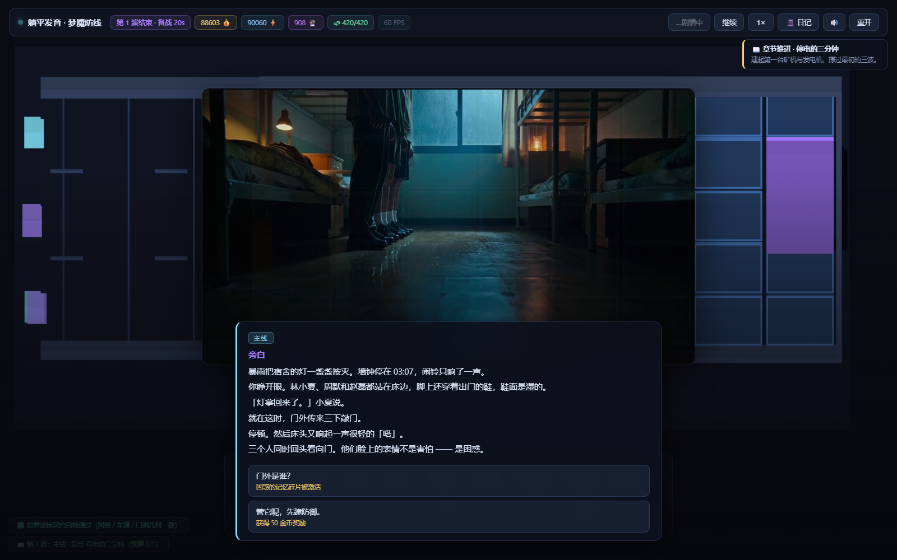
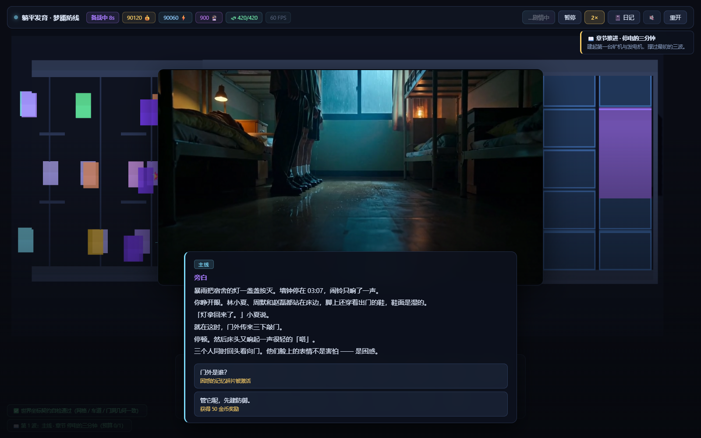
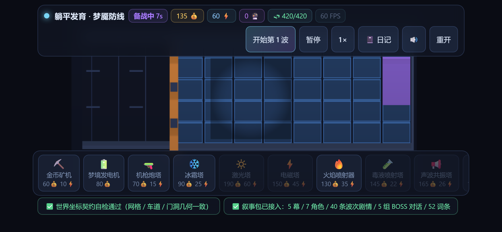

# 躺平发育：梦魇防线 · 3D

> **Tangping Nightmare Defense — 3D.** A browser tower-defense game where a haunted dormitory
> nightmare is told across 60 waves. Three.js + Vite, no game engine, no external art assets.
> All geometry is generated in code; all sound effects are synthesized with WebAudio.

**[▶ 在线试玩](https://yaohanbo1-hue.github.io/tangping-game-3D/)** · 建议横屏 / 桌面浏览器



<p align="center">
  
  
</p>

---

一个中文塔防游戏。你是一个"躺平发育"的宿舍住户，暴雨夜被三个室友叫醒 —— 门外有人敲门。
你要用 17 种防御塔守住这条走廊，同时在 60 波里一点一点弄清：**那七分钟到底发生了什么。**

## 目录

- [它是什么](#它是什么)
- [在线试玩与操作](#在线试玩与操作)
- [怎么跑起来](#怎么跑起来)
- [这个项目里值得一看的工程点](#这个项目里值得一看的工程点)
- [剧情设计：信息释放阶梯](#剧情设计信息释放阶梯)
- [目录结构](#目录结构)
- [验收](#验收)
- [与 2D 版的关系（重要）](#与-2d-版的关系重要)
- [技术栈](#技术栈)

## 它是什么

| | |
|---|---|
| 类型 | 单机塔防 · 剧情驱动 · 一局约 30–50 分钟 |
| 平台 | 浏览器（桌面 + 手机横屏） |
| 结局 | 6 种，由 60 波中的选择与进度共同决定 |
| 内容量 | 60 波 · 5 幕 · 17 种塔 · 28 项科技 · 6 条剧情镜头视频 · 52 条世界观词条 |
| 素材 | 视觉全部代码生成；音效全部 WebAudio 合成；仅配乐与 6 条剧情镜头是外置文件 |

**没有游戏引擎。** 渲染是手写的 Three.js 场景，战斗规则是一套纯逻辑模块，
两者通过一个显式的适配层连接 —— 这也是它能在 2D 与 3D 两种形态之间复用同一套规则的原因。

## 在线试玩与操作

**[https://yaohanbo1-hue.github.io/tangping-game-3D/](https://yaohanbo1-hue.github.io/tangping-game-3D/)**

| 操作 | 桌面 | 手机 |
|---|---|---|
| 选塔 | 点底部建造栏 | 点建造栏 |
| 建造 | 悬停预览 → 点击落子 | **按下即预览** → 抬手落子 |
| 选中已有塔 | 点击 | 点按 |
| 取消 | 点空地 / 点 `✕ 取消` | 同左 |
| 升级 / 转职 / 出售 | 选中后在右侧面板操作 | 同左 |
| 倍速 / 暂停 | 顶栏按钮 | 顶栏按钮 |

> 手机上**竖屏会提示横屏**。塔防需要横向视野，这是有意的取舍，不是没适配。

## 怎么跑起来

```bash
npm install
npm run dev        # http://localhost:5273
npm run build      # 产物在 dist/
npm run preview    # 预览产物
```

要求 Node 18+（开发用 22）。

## 这个项目里值得一看的工程点

### 1. 去像素化：敌人只存「车道 + 进度」，不存坐标

敌人对象上**没有** `x` / `y`。真值源是 `lane`（走哪条道）与 `progress`（0→1 走到哪），
屏幕坐标由 `enemyWorldPos()` 派生：

```
lane + progress  ──enemyWorldPos()──►  { x, y }      (2D)
                 ──enemyWorldPos3D()─►  { x, z }      (3D)
```

状态机完全不知道自己在哪个坐标系里，所以 2D 与 3D 共用同一套战斗逻辑。
`scripts/verify-imports.mjs` 有一条架构边界专门禁止规则层直接给 `e.x` 赋值。

### 2. 世界坐标契约：1 逻辑像素 = 1 厘米

```
UNIT = 0.01          # 1 px = 1 cm
XZ 平面承载原来的 xy，# Y 轴专给高度
1 格 = 1.10 × 0.98 m，场地 12.8 × 7.2 m
```

`src/world.js` **零 import**（连 three 都不引），是纯函数。`assertWorldContract()`
会拿它与 2D 引擎的快照逐项对照 —— 改 `UNIT` 会让两边不再可比，必须重跑全部回归。

### 3. 六条架构边界，构建期强制

不是文档约定，是 `npm run verify:imports` 会失败的硬约束：

| 边界 | 内容 |
|---|---|
| 1 | 3D 不得 import 2D 引擎 |
| 2 | 只有适配层可 import 叙事包 |
| 3 | `world.js` 不得有任何 import，不得出现 `document` / `window` / `THREE` |
| 4 | 规则层不得 import three，不得用相对上级路径 |
| 5 | 规则层不得给 `e.x` / `e.y` 赋值（位置只走解算器） |
| 6 | **叙事包内不得出现 `typeof <全局>` 探测** |

边界 6 值得单独说：在 ESM 里 `typeof <未声明的标识符>` **恒为 `'undefined'`**，
所以这类探测会让整条代码路径静默失效 —— 不抛错、不断言，功能却已经死了。
这条边界真的抓到过 11 处漏改。

### 4. 手机端适配

- **安全区**：`env(safe-area-inset-*)` 全部接入，含横屏的左右刘海
- **触摸预览**：触屏没有 hover，所以按 `pointerType` 分流 —— 手指按下即高亮目标格
  并让幽灵塔跟上，抬手才落子；鼠标路径完全不变
- **自适应分辨率**：按设备能力给 DPR 档位，并根据实测帧时降档（带迟滞，防震荡）
- **性能档位**：移动端默认关闭阴影，桌面保持 `PCFSoftShadowMap`

### 5. 媒体永远不阻塞剧情

6 条剧情镜头视频是**增强，不是依赖**。素材缺失 / 解码失败 / 浏览器不支持时，
整层不出现，文字对白、选项、奖励全部照常。所以把任何一条路径改回 `null` 都是安全的。

镜头切换用**双层交叉淡入**（两个 `<video>` 交叠），换镜头时中间不会闪黑。

## 剧情设计：信息释放阶梯

真相在**第 47–50 波**才揭晓。在那之前，玩家只会拿到越来越不安的线索：

| 波次 | 玩家应该以为 |
|---|---|
| 1–12 | 门外有别的东西 |
| 13–25 | 有人没被写进名单 |
| 26–40 | 镜子里多了一个人 |
| 41–50 | **47 波看清「总人数：四人」→ 50 波真相落定** |
| 51–60 | 消化与回应 |

通关条件是**说出第一句话**，不是撑到第 60 波。

> 这套阶梯是硬约束。`validate-story.js` 里有**泄底检查** —— 任何一句过早透露真相的文本
> 都会让校验失败。泄底是静默失效：游戏照样能跑，只是悬念没了。

## 目录结构

```
src/
  world.js        ★ 世界坐标契约 —— 纯函数，零依赖
  stage.js          正交相机 / 渲染器 / 固定步长主循环
  terrain.js        地形：走廊 + 铁门 + 8×5 房间网格 + 床
  mood.js           氛围层：幕次环境光 / 雾 / 暗角
  enemies.js        敌人渲染（InstancedMesh）+ 死亡溶解
  towers.js         炮塔渲染 + 建造/升级/转职/出售 + 输入绑定
  shots.js          弹道层 + 距离采样拖尾
  board.js        ★ 适配层 —— 规则与 3D 世界的唯一桥
  hud.js            战斗 HUD
  story.js          叙事包适配层（唯一允许 import @tangping/story 的地方）
  story-runtime.js  实现 StoryHost 接口
  story-ui.js       剧情 UI（对话框 / 幕卡 / 日记 / 结局 / 镜头层）
  audio.js          WebAudio 合成音效（24 个具名音效，零外部文件）
  save.js           存档（含 rehydrate，见下）
  ending.js         6 种结局判定
  rules/          ★ 纯逻辑层（6 个模块，与 2D 引擎逐函数对应）
packages/story/     叙事包（数据 + 运行时），见「与 2D 版的关系」
scripts/            7 个无头验收套件 + 素材检查
ui-review-3d/       4 个浏览器端到端验收套件
```

### 一个容易踩的坑：存档不能存函数

建筑的 `def.stat(lv)` 是函数，JSON 存不下。读档后建筑只剩空壳 ——
**数量、血条、等级全对，第一座塔开火时才崩**。所以 `save.js` 里有显式的
`rehydrateEnemies()` / `rehydrateBuildings()`，按 `type` 把真实定义查回来。

## 验收

```bash
npm run verify          # 7 个无头套件（坐标契约 / 边界 / 规则 / 战斗 / 节奏 / 结局）
npm run verify:all      # 上面 + 4 个浏览器套件（需先 npm run dev）
```

| 套件 | 覆盖 |
|---|---|
| `verify:world` | 世界坐标契约（7 组 30 项） |
| `verify:imports` | 6 条架构边界 |
| `verify:rules` | 规则层与 2D 引擎逐函数对拍（69 项） |
| `verify:combat` | 战斗全链路（94 项） |
| `verify:pacing` | 叙事节奏预算 + 泄底检查 + 存档往返（41 项） |
| `verify:ending` | 结局判定与 2D 版逐字段一致 |
| `verify:step4` / `verify:step5` | 浏览器端到端（30 / 96 项，含 60 波通关长局） |
| `verify:video` | 剧情镜头（41 项，含过渡不闪黑、竞态） |
| `verify:mobile` | 手机端（37 项，设备模拟 + 真实触摸 + 真实安全区注入） |
| `verify:dist` | **生产产物**能否真正跑起来（11 项，部署前最后一道关） |

`verify:dist` 值得单独说：前面那些验的都是**源码**，而部署出去的是**打包压缩后的产物** ——
路径、分块、静态资源都可能在这最后一步出问题。它会起一个静态服务器打开 `dist/`，
确认游戏能初始化、能建造、能开波、剧情镜头能出画、且**没有 404**
（那 6 条视频曾因 `.gitignore` 差点被漏掉）。

CI 在部署前会跑无头那 7 套 —— 坏了就部署不上去。

### ⚠️ 有一条在本仓库里跑不了

`verify:ending` 做的是**跨工程一致性**校验：把 3D 的结局定义与 **2D 引擎**里那份
逐字段对拍（rank / tone / 全部文本字段 / 色调表 / 判定行为，92 项）。
它需要 2D 工程的源码在场，而本仓库只有 3D。

所以在本仓库里它会**显式跳过**并打印原因 —— 不崩，但也**不会假装通过**。
想跑这条完整的校验，需要把 2D 工程放在同级的 `tangping-game/` 目录下。

同理，`verify-rules` 与 `verify-imports` 里也有对 2D 源码的交叉校验：
- `verify-rules` 找不到 2D 源码时降级为「仅内部一致性校验」（会在输出里说明）
- `verify-imports` 的**边界 6** 需要叙事包目录。它现在会先找 `packages/story`、
  再找旧位置；**都找不到就直接报错**，而不是静默跳过 —— 这条边界抓到过 11 处真漏改，
  静默跳过等于把最有价值的检查关掉。

## 与 2D 版的关系（重要）

这个仓库是**3D 形态**。它原本与 2D 版并排放在同一个工作目录里，
通过 `file:../tangping-game/src/story` 直接引用 2D 工程的叙事包。

为了让这个仓库能独立构建，**叙事包已被复制进 `packages/story/`**。

> ⚠️ **这意味着叙事数据有两份。**
>
> `packages/story/` 是从 2D 工程的 `src/story/` 生成的**产物**，
> 而 2D 工程的 `src/story/` 又是从它根目录的 `story.js` / `lore.js` /
> `sidestories.js` / `events.js` / `perspectives.js` / `bosslore.js` 生成的。
>
> **改剧情请改 2D 工程的源文件，然后把生成结果同步到这里**，
> 不要直接在这里改 —— 否则两边会静默分叉，而且不会有任何报错。

`packages/story/` 里还有几个**手写**文件（不走生成器）：`host.js`、`runtime-ctx.js`、
`runtime.js`、`pacing.js`、`chapters.js`、`index.js`。

## 技术栈

- **Three.js** 0.169 —— 正交相机，XZ 平面映射 8×5 网格
- **Vite** 5 —— 开发与构建
- **WebAudio** —— 24 个合成音效 + 环境音，零音频素材文件
- **Canvas / DOM** —— HUD 与剧情层用 DOM 覆盖，不用 3D 内嵌文字
- **Playwright**（验收用）—— 设备模拟、真实触摸事件、CDP 安全区注入

## License

代码以 MIT 发布，见 [LICENSE](./LICENSE)。
剧情文本、配乐与 6 条剧情镜头视频版权保留。
